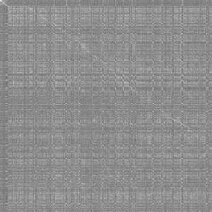
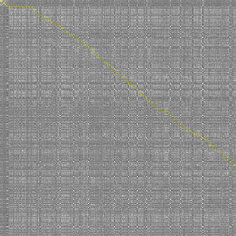
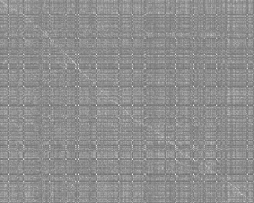
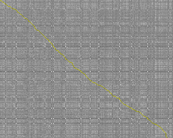

# Make Parallel Text

Make html/ebook containing parallel text from two translations of the same text, or translation to original.
It aligns sentences based on semantic similarity.
Languages used need to be supported by the underlying model, which supports 10+ modern languages.

Languages of two texts can be different, so the main use case now is language learning material generation.
Somewhat stretch of an idea is to align more poetic translation of a text with more verbose one for comparison.
Example here does exactly that with two public domain translations of Iliad into English, taken from Project Gutenberg.

- stretched use case example output: https://sowcow.github.io/make-parallel-text/
- supported languages discussion: https://huggingface.co/sentence-transformers/distiluse-base-multilingual-cased/discussions/2
  > languages: Arabic, Chinese, Dutch, English, French, German, Italian, Korean, Polish, Portuguese, Russian, Spanish, Turkish.
- it supports some unstated there languages too, Serbian for example

## Easy Way of Using It

Prerequisites:
- I think average PC/laptop should be fine
- it should use not more than 2Gb of disk space
- install Docker, do restart if needed

Technical note: this way of running does not involve GPU for ease of use and maximal compatibility, the tradeoff is speed of the process itself.

1. open directory containing two text files to align, I'll call this the `content` directory
1. create inside of it empty subdirectory named `state`
1. make sure books start roughly at the same place (delete intro chapters for example if they differ)
1. run Docker Desktop app if on Windows
1. open terminal in `content` directory and run this command, but replace `A.txt` and `B.txt` with own file names, or just rename files themselves instead:
  `docker run -e RUSTBERT_CACHE=/cache -v model_cache:/cache -v "$(pwd)/state:/state" -v "$(pwd)/A.txt:/app/A.txt" -v "$(pwd)/B.txt:/app/B.txt" ghcr.io/sowcow/make-parallel-text:latest bash -c "./make-parallel-text --context /state --left A.txt --right B.txt --window-size 100"`
1. if all goes well it should download things and start doing the alignment iterations, if process is interrupted and restarted it continues from last complete iteration
1. if all went well then it produces three output files in `state` directory: `2-columns.html` for general vertically divided view, `3-columns.html` has space for notes at the right, `1-column.html` for small devices that do not fit columns well
1. if the process produced alignment that becomes wrong at some point, then you may try to re-run it with bigger window_size - delete and re-create `state` directory to be empty before re-running it; bigger window allows for longer mismatcing segments between texts but reduces process speed significantly

If `.html` files look good, install and use Calibre software for example to make ebook with command like this: `ebook-convert state/3-columns.html output.pdf --margin-top 0 --margin-right 0 --margin-bottom 0 --margin-left 0`

## Known bugs

- handling of ... and .", quotation marks in general possibly too
- potential for lost text at the very end

---

Below goes technical stuff that may be outdated in details.

---

## Technical Stuff

One point this example shows is that anywhere in the middle between more aligned items things are not guaranteed to match at all, yet this does not cause it to fail overall.
Also it shows crude handling of punctiuation overall and a couple of lost lines at the very end, but that is less likely to happen in normal not stretch-case like this one.

  
  

First 300x300 lines/sentences window:

1. in top left corner there is clear diagonal of headers of texts mostly matching each other
1. then unmatched insertion in one of texts produces horizontal or vertical line
1. then things roughly match producing generally diagonal movement

  
  

Final window:

- it shows that path was not lost at any point, final tip of the path is in error because there is no follow-up content to correct it, for this reason windows move with overlap, effectively discarding second half of the found path of every iteration, except in the very end

## Software Dependencies

At https://github.com/guillaume-be/rust-bert it says how to setup libtorch dependency of specific version.
Alternatively there is a feature-flag mentioned that could work too.
This dependency may need env variables to be set after installation.

Also I have CUDA installed, since I use Nvidia GPU.

I configure env variables to use Torch and CUDA in Rakefile, otherwise it ran on CPU for me.
But it could be done in terminal by other means.

Anyway this script prints the device used on run.

## Configuration

In `main.rs` there is `let score_batch = 300`.
The number is a window size of processing.
By default 300 lines/sentences from left file gets compared to 300 from the right one.
Then least cost path in that 300x300 matrix is found.

This means both files should get aligned within the window or the alignment path gets lost for all the following windows.

Assuming translations generally go in parallel it should not be the problem. But in case one of them has unrelated insertions, they should be definetly less than the window size to not have alignment path lost.

Going above 300 gets slower so I kept it this way for own use.
But on some hardware it may need to be reduced for speed or VRAM reasons.

## Input preparation

Ideally, input files should be aligned early as mentioned above.
So for example files I removed all introduction content and therefore other Gutenberg Project references too since the text is altered.

Other than that, general use case is to convert .epub into .txt with calibre software by it's `ebook-convert abc.epub left.txt`.
And then to put them into `input/` dir to replace default example texts.

## Running it

`log/` dir stores intermediate state of processing.
So that dir needs to be deleted every time for clean run when code changes or input files change.
Otherwise running will continue from state in that dir if there is anything left to do.

Main, but non-problematic dependency is `rust` language to be installed, I used `nightly` toolchain.

Other than that, running this is `cargo run --release` by default, it needs to be called inside of `rust/` dir.
Or `rake r` if `Rakefile` is used to configure env variables as I use it.
The rake option requires `ruby` to be installed.

In the process, after every iteration it produces files of intermediate state at `log/`.
To render images of alignment form that data, there is a `ruby` script: `cd ruby; bundle; ruby render_log.rb`

In the end it should produce:
- 1-column.html - portrait view usage idea, untested
- 2-columns.html - landscape mode parallel text
- 3-columns.html - third column is left empty for making notes

Then doing this should produce pdf (here with dimensions for RM device) `wkhtmltopdf --margin-top 0 --margin-right 0 --margin-bottom 0 --margin-left 0 --page-width 12in --page-height 9in 3-columns.html output.pdf`

## Ideas

- Ruby->Rust last bits
- GPU path-finding (would break easy CPU use case), currently single CPU Dijkstra search is a bottleneck (that does not matter for main use case)

## Technical Notes

- Warning: a lot of chat-gpt, ruby->rust conversions, incremental development with older things that may be around still.
- there are simple noise compensations that could affect paths through noisy places, what can be seen on overlaps of those half-windows (the whole noise compensation is not visualized actually, so it may need a first look)
- there is a mechanism to remove bias toward shortcuts of path-finding and to an extent it biases toward diagonal paths. It affects costs of final row/column (and initial ones on the very first iteration).
- I was somewhat surprised that path-finding does it so well with that bias mechanism and half-window movement

# License: [DAFUQPL](https://github.com/dafuqpl/dafuqpl)
